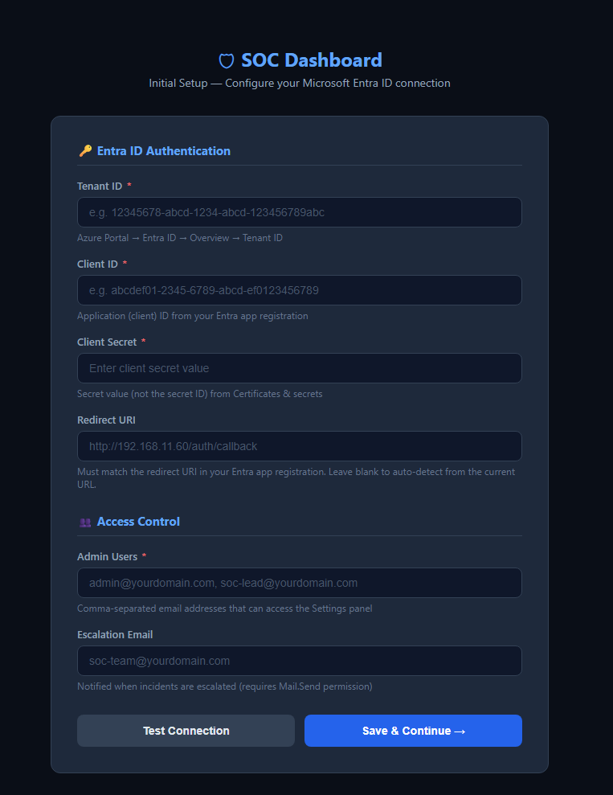
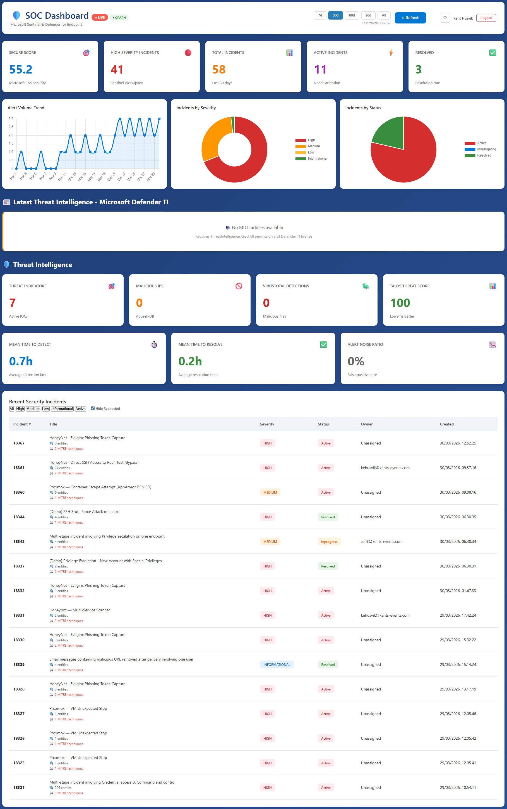

# SOC Dashboard with Defender XDR, Sentinel, KQL, and AI Assistant

Automated Security Operations Center dashboard integrating **Microsoft Defender XDR**, **Microsoft Sentinel**, and **Threat Intelligence** feeds. Entra ID authentication, encrypted config management, SQLite persistence, and real-time incident actions (assign, escalate with email notification).

> **Built to inspire.** Created using AI-assisted (VIBE) coding to demonstrate SOC dashboard patterns. Use as a reference implementation — not validated for large-scale production.

## Screenshots

### First-Run Setup Wizard
On a fresh deployment, the dashboard presents a setup wizard to configure Entra ID credentials — no SSH or `.env` editing required.



### Dashboard
Live incident data from Microsoft Defender XDR with Secure Score, alert trends, threat intelligence, and incident management.



## Quick Start (Local Development)

```bash
# 1. Install dependencies
pip install -r requirements.txt

# 2. Configure credentials (copy template, fill in values)
cp .env.example .env
# Edit .env with your Azure credentials — NEVER commit .env

# 3. Verify secrets are excluded
git check-ignore .env          # should output: .env

# 4. Initialise database and fetch data
python fetch_live_data.py

# 5. Start the dashboard
python dashboard_backend.py

# 6. Open http://localhost:5000
```

### Optional: Automated Refresh
```bash
python hourly_refresh.py          # scheduler (every hour)
# or via Windows Task Scheduler:
powershell -File scripts/setup_task_scheduler.ps1
```

---

## Production Deployment (Ubuntu LXC)

### Prerequisites
- Ubuntu 24.04 LXC container
- Python 3.10+
- Microsoft Entra ID app registration with required permissions (see [Entra ID Setup](#entra-id-app-registration))
- DNS record pointing to your reverse proxy (not directly to the LXC)

### Automated Deployment

**Option A — Git-based (recommended):**
```bash
# 1. On a fresh LXC, clone and deploy in one go
ssh root@<LXC_IP> 'apt-get update -qq && apt-get install -y -qq git && \
  git clone https://github.com/KingKongKent/SOC-Dashboard-for-Sentinel-Data-Lake.git /opt/soc-dashboard && \
  bash /opt/soc-dashboard/scripts/deploy_lxc.sh'

# 2. Open https://<LXC_IP_or_domain> → the Setup Wizard will launch automatically
```

**Option B — SCP-based (no git on server):**
```bash
# 1. Copy files to the LXC
scp *.py *.html requirements.txt .env.example root@<LXC_IP>:/opt/soc-dashboard/
scp -r scripts static root@<LXC_IP>:/opt/soc-dashboard/

# 2. Run the deployment script
ssh root@<LXC_IP> 'bash /opt/soc-dashboard/scripts/deploy_lxc.sh'

# 3. Open https://<LXC_IP_or_domain> → the Setup Wizard will launch automatically
```

The deployment script (`scripts/deploy_lxc.sh`) will:
1. Install system packages (`python3`, `venv`, `nginx`, `certbot`, `curl`, `openssl`)
2. Create a `socdash` service user (no login shell)
3. Set up `/opt/soc-dashboard` (app) and `/var/lib/soc-dashboard` (DB/data)
4. Create a Python venv with all dependencies + gunicorn
5. Merge new `.env.example` keys into existing `.env` (never overwrites existing values)
6. Initialize the SQLite database schema
7. Install systemd units (dashboard service + hourly refresh timer)
8. Auto-detect `server_name` from `REDIRECT_URI` (falls back to LXC IP)
9. Generate a self-signed TLS certificate if no Let's Encrypt cert exists
10. Configure and enable nginx with HTTPS + HTTP→HTTPS redirect
11. Run health checks (services, HTTPS endpoint)

### First-Run Setup Wizard

On a fresh deployment, the dashboard automatically detects that Entra ID credentials are not configured and redirects all traffic to `/setup` — a built-in web-based setup wizard.

The setup wizard lets you:
- Enter **Tenant ID**, **Client ID**, and **Client Secret** from your Entra app registration
- **Test the connection** against Azure AD before saving
- Configure **Admin Users** (email addresses) and **Escalation Email**
- Set the **Redirect URI** (auto-detected from your browser URL)

Credentials are saved to the encrypted config database — no need to SSH in and edit `.env`. Once saved, the setup page locks itself and redirects to the normal login flow.

> **No `.env` editing required for first-time setup.** The `.env` file retains placeholder values; the setup wizard writes real credentials to the encrypted SQLite config, which takes precedence.

### What Gets Created

| Component | Path | Purpose |
|-----------|------|---------|
| App files | `/opt/soc-dashboard/` | Read-only application code |
| Database | `/var/lib/soc-dashboard/soc_dashboard.db` | SQLite database (writable) |
| Encryption key | `/var/lib/soc-dashboard/.encryption_key` | Fernet key for config secrets |
| Flask sessions | `/var/lib/soc-dashboard/flask_sessions/` | Session file storage |
| Credentials | `/etc/soc-dashboard/.env` | Environment vars (chmod 600) |
| TLS cert (auto) | `/etc/ssl/soc-dashboard/` | Self-signed cert (if no Let's Encrypt) |
| Service | `dashboard.service` | gunicorn on 127.0.0.1:5000 (2 workers) |
| Timer | `hourly-refresh.timer` | Runs `append_data.py` every 1 hour |
| Nginx | `/etc/nginx/sites-available/soc-dashboard` | TLS reverse proxy |

### Critical Deployment Notes

> **If running multiple dashboard instances, deploy to the correct one!**
> Keep a local record of which domain maps to which server and app entry point.
> Files in **this workspace** are for the single-page `dashboard_backend:app` variant.
> Do **not** deploy them to a server running the `src/` package codebase.

**Database path:** The `DB_PATH` environment variable must be set in `.env` to `/var/lib/soc-dashboard/soc_dashboard.db`. If the systemd `WorkingDirectory` is wrong and `DB_PATH` is unset, a new empty DB gets created in the wrong location.

**Encryption key:** `config_manager.py` auto-generates a Fernet key on first run. **Never delete `.encryption_key`** — all encrypted settings in the DB become unreadable.

**`.env` permissions:** Must be `chmod 600`, owned by `socdash`. The deployment script sets this, but manual edits can reset permissions.

**Gunicorn (not Flask dev server):** Production must use gunicorn via `dashboard.service`. Flask's dev server is single-threaded and unsuitable.

**Systemd HOME with `ProtectHome=true`:** If home-directory hardening is enabled, set `HOME` in `dashboard.service` to a writable non-home path (for example `/var/lib/soc-dashboard`). This prevents Gunicorn startup errors like `Control server error: [Errno 13] Permission denied: '/home/socdash'`.

**SQLite concurrency:** With multiple gunicorn workers writing simultaneously, you may see "database is locked" errors. Enable WAL mode if needed: `PRAGMA journal_mode=WAL`.

### TLS Certificate

```bash
# On the LXC, after DNS is configured:
certbot certonly --webroot -w /var/www/html -d your-domain.com
# Use RSA key type for maximum browser compatibility:
certbot certonly --key-type rsa --preferred-chain 'ISRG Root X1' -d your-domain.com
```

> ECDSA certs (Let's Encrypt E7, ISRG Root X2) may show "Not Secure" on some Windows machines. RSA certs (R12, ISRG Root X1) are universally trusted.

### Reverse Proxy Configuration

If traffic routes through an upstream proxy (SNI/stream routing), uncomment the proxy protocol lines in `scripts/nginx_site.conf`:

```nginx
listen 443 ssl http2 proxy_protocol;
set_real_ip_from <PROXY_IP>;
real_ip_header proxy_protocol;
```

**DNS must point to the proxy, not directly to the LXC.** Direct connections bypass the proxy protocol preamble and cause `ERR_CONNECTION_RESET`.

### Updating After Code Changes

**Git-based update (recommended):**
```bash
# Pull latest and restart services automatically
ssh root@<LXC_IP> 'bash /opt/soc-dashboard/scripts/update_from_git.sh'

# Or with options:
#   --branch dev          Pull from a different branch
#   --no-restart          Pull code without restarting services
#   --full-deploy         Re-run deploy_lxc.sh (for dependency or config changes)
```

The update script will:
- Pull the latest commit (fast-forward only)
- Stash any local hotfixes before pulling
- Update pip dependencies if `requirements.txt` changed
- Restart the `dashboard` service and verify health
- Reload nginx if `nginx_site.conf` changed (with config validation)

**Manual SCP update:**
```bash
scp <changed_files> root@<LXC_IP>:/opt/soc-dashboard/
ssh root@<LXC_IP> 'systemctl restart dashboard'
```

---

## Entra ID App Registration

### Required Application Permissions

| API | Permission | Type | Purpose |
|-----|-----------|------|---------|
| Microsoft Graph | `SecurityIncident.Read.All` | Application | Fetch incidents |
| Microsoft Graph | `SecurityIncident.ReadWrite.All` | Application | Assign/escalate incidents |
| Microsoft Graph | `SecurityEvents.Read.All` | Application | Read security events / Secure Score |
| Microsoft Graph | `User.Read.All` | Application | User lookup |
| Microsoft Graph | `ThreatIntelligence.Read.All` | Application | MDTI articles *(optional — requires Defender TI license)* |

### Required Delegated Permissions

| API | Permission | Type | Purpose |
|-----|-----------|------|---------|
| Microsoft Graph | `User.Read` | Delegated | User profile during login |
| Microsoft Graph | `Mail.Send` | Delegated | Escalation email (sent from user's own mailbox) |

> **Note:** `Mail.Send` is **delegated** (not application). The app can only send email as the
> currently logged-in user — it cannot send as arbitrary users. Users consent to this scope
> on first login. If admin consent is required in your tenant, grant it in Entra → App
> registrations → API permissions.

After adding permissions, **grant admin consent** — requires Global Administrator or Privileged Role Administrator.

### Redirect URI

Register in Entra: `https://<your-domain>/auth/callback`

Missing this causes `AADSTS50011` errors during login.

### Auth Flow

- **User login:** MSAL authorization code flow (interactive browser login)
- **API calls to Graph:** Client credentials flow (app-only token)
- **Admin detection:** `ADMIN_USERS` env var (comma-separated emails), not directory roles
- **Session:** Filesystem-based, 8-hour lifetime, `HttpOnly` + `SameSite=Lax` + `Secure` cookies

---

## Configuration

### `.env` Variables

```env
# Required — Entra ID App Registration
CLIENT_ID=your-app-client-id
CLIENT_SECRET=your-client-secret
TENANT_ID=your-tenant-id

# Required — Auth
SECRET_KEY=<random-hex-string>
REDIRECT_URI=https://your-domain.com/auth/callback
CORS_ORIGINS=https://your-domain.com
ADMIN_USERS=admin@yourdomain.com

# Optional — Sentinel
SENTINEL_WORKSPACE_ID=your-workspace-id
SENTINEL_WORKSPACE_NAME=your-workspace-name

# Optional — Threat Intel API Keys
VIRUSTOTAL_API_KEY=
ABUSEIPDB_API_KEY=
TALOS_API_KEY=

# Optional — Escalation
ESCALATION_EMAIL=soc-team@yourdomain.com

# Optional — Operational
REFRESH_INTERVAL_MINUTES=60
INCIDENTS_DISPLAY_LIMIT=100
MDTI_ENABLED=true
VIRUSTOTAL_ENABLED=true
CLOSE_INCIDENT_ENABLED=false
DB_PATH=/var/lib/soc-dashboard/soc_dashboard.db
CONFIG_KEY_PATH=/var/lib/soc-dashboard/.encryption_key
```

### Config Management

Settings can be managed in two ways:
1. **`.env` file** — read on startup
2. **Admin Settings UI** — stored encrypted in SQLite, takes precedence over `.env`

Secrets (`CLIENT_SECRET`, API keys) are Fernet-encrypted at rest in the database. The encryption key at `CONFIG_KEY_PATH` is generated on first run — **do not delete it**.

---

## API Endpoints

| Route | Method | Auth | Purpose |
|-------|--------|------|---------|
| `/setup` | GET | — | First-run setup wizard (redirects to `/login` once configured) |
| `/api/setup` | POST | — | Save initial config (locked after setup completes) |
| `/api/setup/test-connection` | POST | — | Test Graph API credentials before saving |
| `/login` | GET | — | Initiates Entra ID OAuth2 flow |
| `/auth/callback` | GET | — | Entra redirect target (exchanges code for token) |
| `/logout` | GET | — | Clears session, redirects to `/login` |
| `/` | GET | `@require_login` | Serves the dashboard SPA |
| `/api/me` | GET | `@require_login` | Returns current user info |
| `/api/dashboard-data` | GET | `@require_login` | Incidents, alerts, metrics, secure score (supports `?days=`, `?severity=`, `?status=` filters) |
| `/api/database-stats` | GET | `@require_login` | Row counts and date ranges |
| `/api/incidents/<id>/assign` | POST | `@require_login` | Assigns incident in Defender XDR + local DB |
| `/api/incidents/<id>/escalate` | POST | `@require_login` | Bumps severity to High, adds tag + comment, sends email |
| `/api/incidents/<id>/close` | POST | `@require_login` | Closes incident in Defender XDR with classification + determination (requires `CLOSE_INCIDENT_ENABLED`) |
| `/api/settings` | GET | `@require_admin` | Returns all config (secrets masked) |
| `/api/settings` | PUT | `@require_admin` | Updates config values |
| `/api/settings/test-connection` | POST | `@require_admin` | Tests Graph API connectivity |
| `/api/refresh` | POST | `@require_admin` | Triggers async data refresh (returns immediately; poll `/api/refresh/status`) |
| `/api/refresh/status` | GET | `@require_admin` | Returns refresh status (`idle`/`running`/`completed`/`error`) |
| `/api/features` | GET | `@require_login` | Returns feature toggle states (JSON) |
| `/api/logs` | GET | `@require_admin` | Returns recent gunicorn error log + systemd journal entries |
| `/api/logs/download` | GET | `@require_admin` | Download log bundle as text file |
| `/api/sentinel/query` | POST | `@require_login` | Execute a KQL query (requires `KQL_CONSOLE_ENABLED`) |
| `/api/sentinel/ai` | POST | `@require_login` | Ask the AI assistant (requires `AI_ASSISTANT_ENABLED`) |
| `/api/incidents/<id>/attack-story` | POST | `@require_login` | Generate/retrieve AI attack story (requires `AI_ASSISTANT_ENABLED`) |
| `/api/incidents/<id>/ai-enrich` | POST | `@require_login` | AI-analyse an incident and post analysis as Sentinel comment (requires `AI_ASSISTANT_ENABLED`) |
| `/api/incidents/<id>/copilot-enrich` | POST | `@require_login` | Security Copilot enrichment via Foundry agent — risk score, entity reputations, actions (requires `SECURITY_COPILOT_ENABLED`) |
| `/api/incidents/<id>/enrichment` | GET | `@require_login` | Return latest enrichment data for an incident |
| `/api/webhooks/copilot-enrichment` | POST | HMAC | Logic App webhook callback for async enrichment results |

---

## Features

| Area | Detail |
|------|--------|
| **Authentication** | Entra ID OAuth2 with MSAL, admin role via email list |
| **Secure Score** | Live from Microsoft Graph API with category breakdown |
| **Incidents** | Timeline filtering (7d–90d), separate Severity and Status filters, dual status labels (`New`, `In progress (Active)`, `Resolved (Closed)`), hide-redirected toggle, configurable table row limit (`INCIDENTS_DISPLAY_LIMIT`) |
| **Incident Actions** | Assign to Me, Escalate (severity bump + email notification), and optional Close Incident action with Graph classification/determination |
| **Local Case Tracking** | Per-incident notes, status tagging, and deep-link to Defender Cases portal |
| **Alerts** | Linked to incidents, product and detection source breakdown |
| **Threat Intel** | IOC extraction (IPs, URLs, users, files, devices) from incident entities, VirusTotal, AbuseIPDB, MDTI articles |
| **Redirected Incidents** | Detected and labeled with target incident link; hidden by default to reduce noise |
| **Admin Settings** | Web UI for managing API keys, refresh interval, escalation email |
| **Encrypted Config** | Secrets stored with Fernet encryption in SQLite |
| **AI Assistant** | Chat-based security analysis via Azure AI Foundry with Sentinel MCP tools (agent mode) and direct OpenAI fallback. Auto-executes KQL from responses. Toggle: `AI_ASSISTANT_ENABLED` |
| **Security Copilot Enrichment** | On-demand incident enrichment via Foundry agent — risk score (0–100 with severity gauge), executive summary (markdown-rendered), recommended actions, and entity reputation analysis. Results cached 1 hour. Comment auto-posted to Sentinel (≤1000 chars). Toggle: `SECURITY_COPILOT_ENABLED` |
| **AI Analysis** | Lightweight AI incident analysis with markdown-rendered output. Auto-posts comment to Sentinel with 2-minute dedup window. Toggle: `AI_ASSISTANT_ENABLED` + `AI_AUTO_COMMENT_ENABLED` |
| **KQL Console** | Run ad-hoc KQL queries against Log Analytics with 11 built-in templates, Ctrl+Enter shortcut, and tabular results. Toggle: `KQL_CONSOLE_ENABLED` |
| **Attack Stories** | AI-generated incident narratives cached in SQLite — timeline, entities, MITRE mapping, next steps |
| **Feature Toggles** | 11 admin-controlled toggles: AI Assistant, KQL Console, Defender TI Articles (MDTI), AI Auto-Enrich, AI Auto-Comment, Close Incident, Logs Viewer, Security Copilot, Copilot Auto-Enrich, Copilot Auto-Enrich Max Per Cycle, VirusTotal |
| **Async Refresh** | Background data refresh via `/api/refresh` — frontend polls status with animated progress. systemd timer (hourly) + configurable interval via settings |

## Project Structure

```
SOC-Dashboard/
├── dashboard_backend.py       # Flask API server + auth routes + security headers
├── database.py                # SQLite schema, CRUD, update helpers
├── fetch_live_data.py         # Graph API data fetchers + write helpers (assign, escalate, email)
├── auth.py                    # Entra ID MSAL login flow + @require_login / @require_admin
├── config_manager.py          # Encrypted config CRUD (DB → env fallback)
├── ai_assistant.py            # AI Foundry integration — agent (MCP tools) + direct fallback
├── security_copilot.py        # Security Copilot enrichment — prompt builder, response parser, webhook
├── sentinel_kql.py            # KQL query engine — Log Analytics REST API
├── ioc_upload.py              # IOC upload engine — Sentinel TI API + feed ingestion
├── append_data.py             # Incremental data append logic
├── hourly_refresh.py          # Scheduler with timeout wrapper
├── soc-dashboard-live.html    # Single-page dashboard frontend (Chart.js, vanilla JS)
├── setup.html                 # First-run setup wizard (Entra ID credentials)
├── static/
│   ├── favicon.svg            # Shield favicon
│   └── chart.umd.min.js      # Chart.js 4.4 local bundle (CDN fallback)
├── requirements.txt           # Python dependencies
├── .env.example               # Credential template (safe to commit)
├── scripts/
│   ├── deploy_lxc.sh          # Automated LXC deployment
│   ├── setup_systemd.sh       # systemd service + timer creation
│   ├── nginx_site.conf        # nginx reverse proxy template (with proxy_protocol support)
│   ├── pre_commit_check.py    # Pre-commit secret scanner
│   ├── reset_test_lxc.sh      # Full test LXC reset (wipe DB/sessions/config, pull latest)
│   ├── generate_demo_data.py  # Standalone demo data generator
│   └── update_from_git.sh     # Git-based pull + service restart
├── docs/
│   ├── ARCHITECTURE.md        # System architecture & data flow
│   ├── INVENTORY.md           # File-by-file inventory
│   └── SECURITY_FIXES.md      # Tracked vulnerability patches
└── .github/
    └── copilot-instructions.md # Copilot coding conventions & pitfalls
```

## Security

- All credentials via `.env` + `python-dotenv` — **never hardcoded**
- Secrets encrypted at rest with Fernet in SQLite config table
- `.gitignore` blocks `.env`, `*.key`, `*.pem`, `*secret*`, `*.db`
- Pre-commit script scans for leaked secrets and local paths (`scripts/pre_commit_check.py`)
- PII & infrastructure scan before commits (usernames, internal IPs, private domains)
- CSP headers restrict script/style/font sources to `https://cdn.jsdelivr.net`
- All routes auth-protected (`@require_login` for users, `@require_admin` for settings)
- SQL queries use parameterized `?` placeholders — no f-strings in SQL
- `update_incident_field()` uses column whitelist — no arbitrary column updates
- See [docs/SECURITY_FIXES.md](docs/SECURITY_FIXES.md) for tracked patches

## Technologies

- **Frontend:** HTML5, CSS3, JavaScript, Chart.js 4.4.0
- **Backend:** Python 3.10+, Flask 3.1.3, Flask-CORS, Flask-Session
- **Auth:** MSAL 1.35 (Entra ID OAuth2 authorization code flow)
- **Database:** SQLite3 with JSON data blobs
- **Encryption:** cryptography (Fernet)
- **Production server:** gunicorn (2 workers, systemd managed)
- **Reverse proxy:** nginx with TLS (Let's Encrypt)
- **Scheduling:** systemd timer (production) / schedule library (development)
- **APIs:** Microsoft Graph Security, Defender XDR, VirusTotal, AbuseIPDB

## Future Enhancements

- [x] SQLite database for historical data
- [x] Timeline filtering (7/30/60/90/all days)
- [x] Hourly automated refresh
- [x] Real MTTD/MTTR calculations
- [x] Entity extraction and tracking
- [x] Entra ID authentication with admin roles
- [x] Encrypted settings management
- [x] Incident actions (assign, escalate with email)
- [x] Redirected incident detection and filtering
- [x] First-run web setup wizard (no SSH required for initial config)
- [x] Local case tracking with Defender Cases deep-link
- [x] Improved entity/IOC extraction (IPs, URLs, users, files, devices)
- [x] FHS-compliant deployment layout (noexec-safe `/opt`)
- [x] PII & infrastructure leak prevention in pre-commit checks
- [x] Async background refresh with frontend polling and animated progress
- [x] Logs viewer and download (gunicorn + systemd journal)
- [x] VirusTotal toggle (enable/disable from settings UI)
- [x] Test LXC reset script (`scripts/reset_test_lxc.sh`)
- [x] Chart.js local bundle fallback (CDN-restricted networks)
- [ ] WebSocket live streaming for instant updates
- [ ] Multi-workspace support
- [ ] Export incident reports to PDF/Excel
- [x] Custom KQL query builder
- [x] AI Assistant with Sentinel MCP tools (Azure AI Foundry)
- [ ] Rate limiting on API endpoints

## License

MIT — see [LICENSE](LICENSE)
- [ ] Advanced correlation rules

## 📝 Development

```bash
# Start backend in debug mode (auto-reload enabled)
python dashboard_backend.py
# Server reloads automatically when Python files change

# Fetch fresh data while server is running
python fetch_live_data.py
python append_data.py

# Test date filtering
# Open http://localhost:5000 and click 7d, 30d, 60d, 90d, All buttons

# Check database stats
python -c "from database import get_database_stats; print(get_database_stats())"
```

## 🏗️ Architecture

```
┌─────────────────┐
│    Browser      │
│  (Dashboard)    │ ← Auto-refresh every 60 min
└────────┬────────┘
         │ HTTP GET with ?days=30
         ▼
┌─────────────────┐
│  Flask Server   │
│  (Port 5000)    │ ← API with date filtering
└────────┬────────┘
         │
         ▼
┌─────────────────┐
│ soc_dashboard.db│ ← SQLite with indexed queries
│  • 100 incidents│
│  • 316 alerts   │
│  • 191 entities │
└────────┬────────┘
         ▲
         │
┌────────┴────────┐
│ hourly_refresh  │ ← Runs every hour
│     .py         │
└────────┬────────┘
         │
         ├─► Microsoft Defender (MCP)
         ├─► Microsoft Sentinel (MCP)
         ├─► Microsoft Graph API
         └─► Threat Intel APIs (VT, Talos, AbuseIPDB)
```

## 🤝 Contributing

This is a live SOC dashboard project. Contributions welcome for:
- Additional threat intelligence sources
- Advanced KQL queries for Sentinel
- Custom visualization components
- Performance optimizations
- Security enhancements

## 📄 License

This project is licensed under the MIT License - see the [LICENSE](LICENSE) file for details.

### Third-Party Licenses

This project uses the following open-source dependencies:

| Package | License | Compatible |
|---------|---------|------------|
| Flask | BSD-3-Clause | ✅ Yes |
| Werkzeug | BSD-3-Clause | ✅ Yes |
| Jinja2 | BSD-3-Clause | ✅ Yes |
| Flask-CORS | MIT | ✅ Yes |
| Requests | Apache 2.0 | ✅ Yes |
| python-dotenv | BSD-3-Clause | ✅ Yes |
| schedule | MIT | ✅ Yes |
| msal | MIT | ✅ Yes |
| certifi | MPL-2.0 | ✅ Yes |
| urllib3 | MIT | ✅ Yes |
| Chart.js | MIT | ✅ Yes |

**All dependencies use permissive open-source licenses compatible with commercial and non-commercial use.**

### Microsoft API Usage

This dashboard integrates with Microsoft services:
- **Microsoft Defender** - Requires valid Microsoft 365 E5 or Defender subscription
- **Microsoft Sentinel** - Requires Azure subscription and Sentinel workspace
- **Microsoft Graph API** - Covered under Microsoft API Terms of Use
- **Microsoft Entra ID** - Requires valid Azure AD/Entra ID tenant

**Note:** Access to Microsoft APIs requires proper licensing from Microsoft. This project does not provide or include any Microsoft licenses.

### External Threat Intelligence APIs

Optional integrations with third-party services:
- **VirusTotal** - Free tier available, API key required
- **AbuseIPDB** - Free tier available, API key required  
- **Cisco Talos** - May require enterprise license

Check each service's terms of use and licensing requirements separately.

## ⚖️ Disclaimer

This software is provided "as is" without warranty. Users are responsible for:
- Obtaining necessary Microsoft licenses and subscriptions
- Complying with Microsoft API terms of service
- Ensuring proper security and access controls
- Meeting regulatory and compliance requirements
- Obtaining API keys and licenses for third-party services

The authors assume no liability for misuse or unauthorized access to security data.
