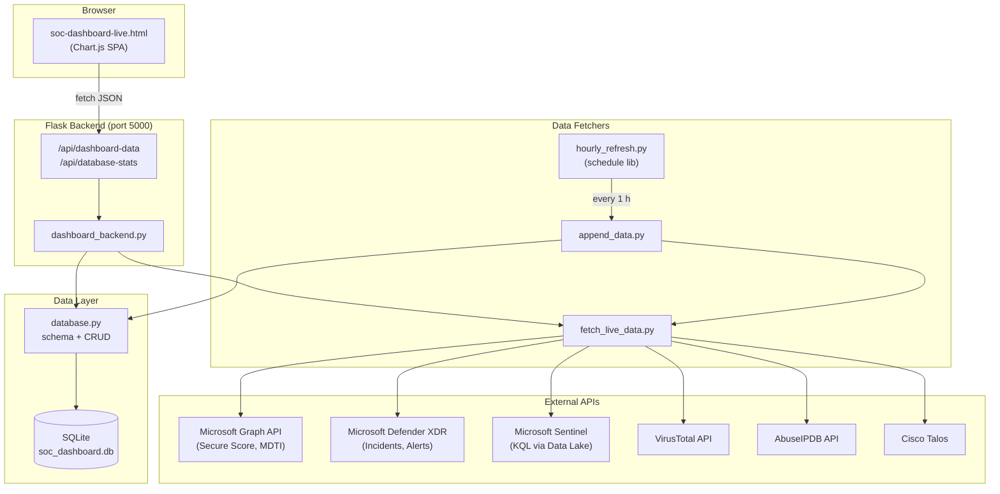
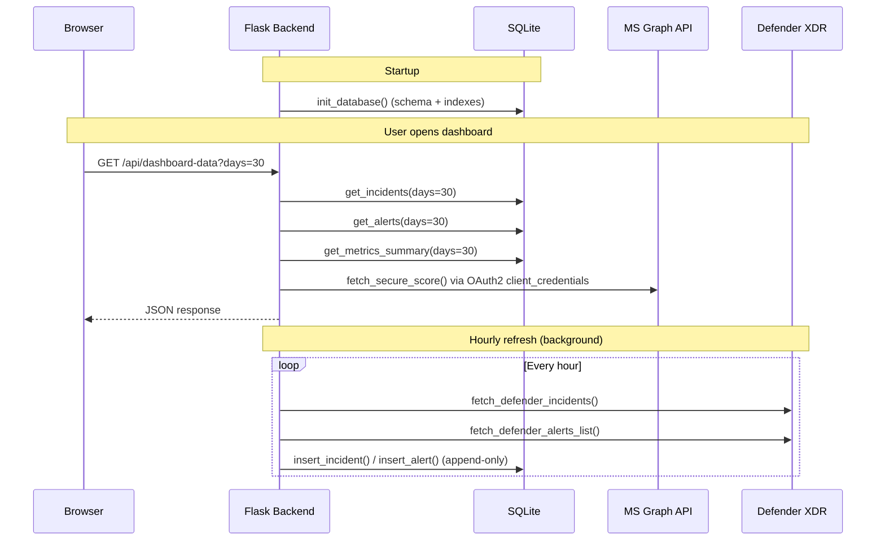
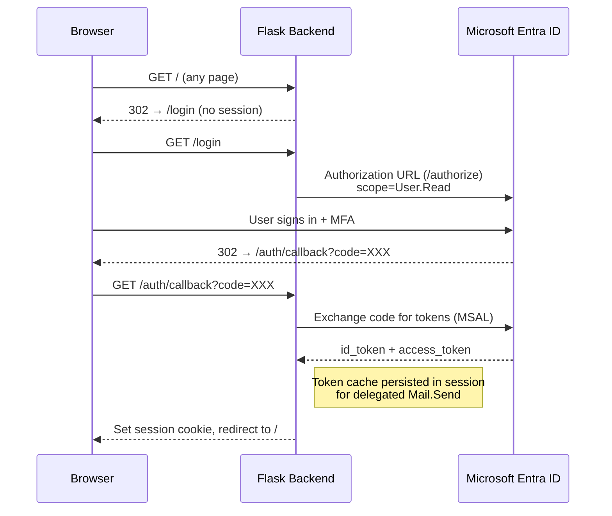
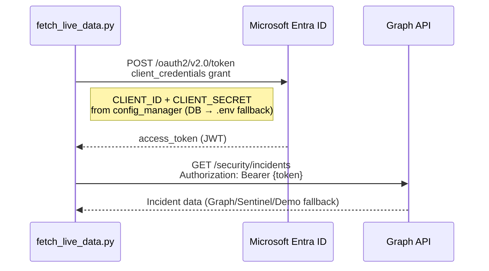

# Architecture — SOC Dashboard for Microsoft Defender XDR

## Overview

The SOC Dashboard is a Python/Flask web application that aggregates security data
from Microsoft Defender XDR, Microsoft Sentinel, and third-party threat intelligence
feeds into a single-pane-of-glass view for SOC analysts.

## Component Diagram



## Data Flow



## Authentication Flow

### User Login (Entra ID — OAuth2 Authorization Code Flow)



- Multi-tenant: authority = `https://login.microsoftonline.com/common`
- Delegated scopes: `User.Read`, `Mail.Send` — consented at login
- Admin access: Entra app role (configurable name, default `Admin`) checked by `@require_admin` decorator
- Sessions: Flask-Session (filesystem), 8-hour lifetime, SameSite=Lax
- Escalation email: sent via `/me/sendMail` using the user's delegated token (not client_credentials) — the app can only send as the logged-in user

### Backend API Auth (Client Credentials — Machine-to-Machine)



## Configuration System

All credentials and settings are managed through `config_manager.py` with two-tier lookup:
1. **SQLite `config` table** (set via Settings UI, encrypted for secrets)
2. **Environment variables** (`.env` file, fallback)

- Encryption: Fernet (AES-128-CBC) via `cryptography` library
- Key file: auto-generated at `CONFIG_KEY_PATH` (default: `config.key`)
- Secrets (CLIENT_SECRET, VIRUSTOTAL_API_KEY, etc.) are encrypted at rest in the DB
- Settings UI accessible to admin users only

## Database Schema (SQLite)

| Table | Purpose | Key Columns |
|-------|---------|-------------|
| `incidents` | Defender/Sentinel incidents | id (PK), title, severity, status, created_time, data (JSON) |
| `alerts` | Alerts linked to incidents | id (PK), incident_id (FK), title, severity, timestamp, data (JSON) |
| `entities` | IOC entities from incidents | incident_id (FK), entity_type, entity_name, verdict |
| `threat_intel_snapshots` | Point-in-time TI data | timestamp, source, data (JSON) |
| `metrics_snapshots` | Dashboard metrics over time | timestamp, secure_score, severity counts |
| `config` | App configuration & encrypted secrets | key (PK), value, is_encrypted, updated_at |

### Indexes
- `idx_incidents_created` — fast date range queries
- `idx_incidents_severity` / `idx_incidents_status` — filter queries
- `idx_alerts_incident` / `idx_alerts_timestamp` — join + range
- `idx_entities_incident` / `idx_entities_type` — entity lookups

## Technology Stack

| Layer | Technology |
|-------|-----------|
| Frontend | Vanilla HTML/CSS/JS, Chart.js 4.4 |
| Backend | Python 3, Flask 3.1, Flask-CORS, Flask-Session |
| Database | SQLite 3 (file-based) |
| Auth (user) | MSAL 1.31 (authorization code flow, multi-tenant) |
| Auth (API) | MSAL 1.31 (client_credentials) |
| Encryption | cryptography (Fernet) for config secrets |
| HTTP | requests 2.32 |
| Scheduler | schedule 1.2 / systemd timer (production) |
| Config | python-dotenv 1.0 |
| WSGI | gunicorn (production) |
| Reverse Proxy | nginx with TLS |

## Production Deployment Topology

> The diagram below is a **reference example**. Adjust IPs, domain names, and
> infrastructure components to match your own environment.

```mermaid
graph LR
    subgraph "Client Network"
        BROWSER["Browser"]
    end

    subgraph "DNS"
        DNS["your-domain.com<br/>→ LXC or Proxy IP"]
    end

    subgraph "Optional: Reverse Proxy"
        SNI["nginx stream<br/>SNI router :443"]
    end

    subgraph "Dashboard LXC (Ubuntu 24.04)"
        NGINX["nginx :443<br/>TLS termination"]
        GUNICORN["gunicorn :5000<br/>2 workers"]
        FLASK["dashboard_backend.py"]
        SQLITE[(SQLite<br/>/var/lib/soc-dashboard/)]
        TIMER["systemd timer<br/>hourly-refresh"]
        FETCH["append_data.py"]
    end

    subgraph "External APIs"
        MSAPI["Microsoft Graph<br/>Defender XDR<br/>Sentinel"]
        TI["VirusTotal<br/>AbuseIPDB<br/>Talos"]
    end

    BROWSER -->|"HTTPS"| DNS
    DNS --> SNI
    SNI -->|"proxy_protocol"| NGINX
    NGINX -->|"HTTP"| GUNICORN
    GUNICORN --> FLASK
    FLASK --> SQLITE

    TIMER -->|"every 1h"| FETCH
    FETCH --> SQLITE
    FETCH --> MSAPI
    FETCH --> TI
```

### systemd Service Architecture

| Unit | Type | Purpose |
|------|------|---------|
| `dashboard.service` | notify (gunicorn) | Flask API + HTML serving, 2 workers, bound to 127.0.0.1:5000 |
| `hourly-refresh.service` | oneshot | Single data fetch run via `append_data.py` |
| `hourly-refresh.timer` | timer | Triggers refresh every hour (OnBootSec=2min, OnUnitActiveSec=1h) |

### Infrastructure Details

> Adjust these values for your deployment.

| Component | Detail |
|-----------|--------|
| Dashboard LXC | Ubuntu 24.04, your LXC IP, in DMZ or appropriate network segment |
| Reverse Proxy (optional) | nginx stream block with SNI routing + proxy_protocol |
| DNS | Point your domain to the proxy (if used) or LXC directly |
| TLS | Let's Encrypt via certbot, ACME challenge on port 80 |
| Service user | `socdash` — no-login system user, owns DB + .env |

## Deployment Notes

- **Production deployment** uses gunicorn behind nginx with TLS
- **Proxy protocol** — if using an upstream SNI proxy, uncomment the proxy_protocol lines in `nginx_site.conf`. Direct connections to the LXC will fail without the expected preamble.
- **SQLite limits** — append-only model; gunicorn workers + hourly timer can cause `database is locked` under load. Consider WAL mode.
- **Credentials** — all via `.env` file (chmod 600); never in source control
- **Dashboard authentication** — Entra ID login required (OAuth2 authorization code flow, multi-tenant)
- **Admin access** — Entra app role (configurable, default `Admin`) required for settings page
- **Config encryption** — Secrets stored in SQLite `config` table are Fernet-encrypted; key stored at `CONFIG_KEY_PATH`
